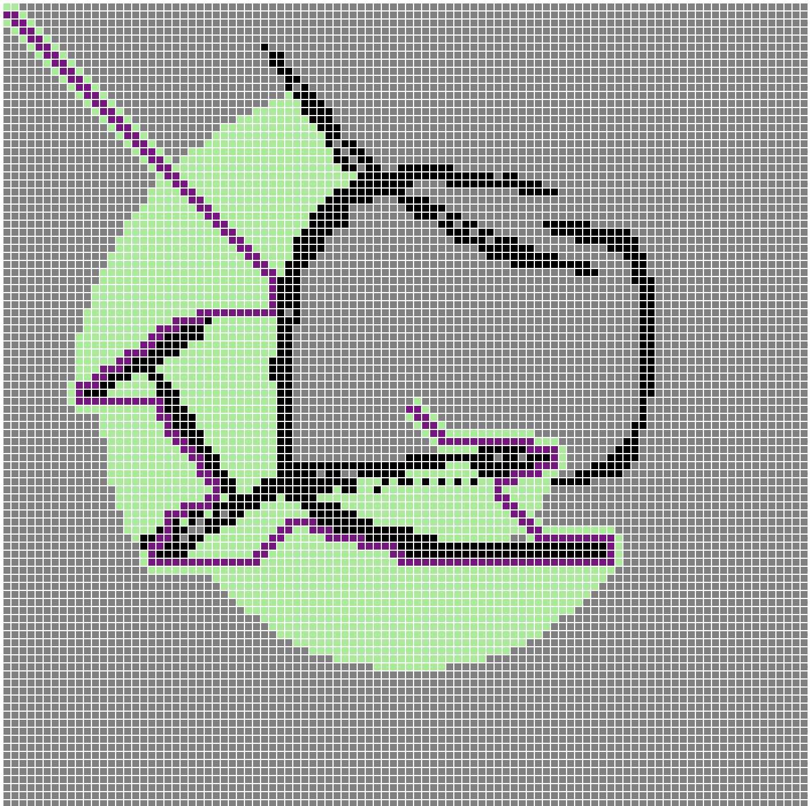

# 学习笔记

## 搜索算法
1. 广度优先搜索算法，用队列实现，对应数组的push和shift方法。
2. 深度优先搜索算法，用栈实现，对应数组的push和pop方法。

## JavaScript的数组，是一个天然的队列，也是一个天然的栈。shift()、unshift()、push()、pop()。
1. push和shift对应就是一个队列。pop和unshift对应就是一个队列。
1. push和pop对应就是栈。shift和unshift也是栈。一般不用shift和unshift去做栈，考虑到JS的实现，shift/unshift组合会使性能降低。

## 寻路实现
寻路需要实现广度优先搜索算法、UI的部分，JS特有的和语言结合的部分、异步编程、算法的步骤可视化。

**寻路 ｜ 1.实现一个地图编辑器**
1. 10000格的地图：新建一个数组Array(10000).fill(0);
1. 地图编辑器，监听mousemove，实现按住鼠标后移动即可绘制。
1. 保存功能，使用localStorage保存地图数据

**寻路 ｜ 2.广度优先搜索**
1. 队列，使用数组的push和shift实现入队和出队。

**寻路 | 3.通过异步编程可视化寻路算法**
1. async/await

**寻路 | 4.处理路径问题**
1. 标示前驱节点

**寻路 | 5.启发式搜索（一）**

广度优先搜索并不是最好的方式。启发式是通过函数去判断拓展的优先级。

1. 实现一个Sorted数据结构
2. 根据distance寻找最佳点

**寻路 | 6.启发式搜索（二）**
1. 根据最短路径寻找最佳前驱节点

2.（想法未做）找到路径之后，将路径分成若干段，每一段分别寻找路径？
